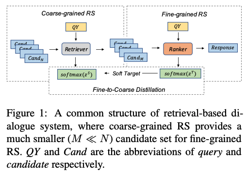

# [💬] Multi-turn Response Selection, MRS [💬]

1. **Two ways of response selection in MRS**
- coarse-grained
    - select among all candidates
- fine-grained
    - filter candidates
    - select among candidates

2. **Related papers**
- [paper-with-code](https://paperswithcode.com/task/conversational-response-selection)
- [Ubuntu Dialogue, Douban, E-commerce] are the ones that are mostly utilized.
    - Ubuntu Corpus V1 (English)
        - topics related to Ubuntu: ubuntu dialogue dataset
        - dataset are provided with special character, number, system paths already pre-processed.
    - Douban Corpus (Chinese)
        - open domain conversation dataset provided from Douban Group
        - Douban: a famous social networking service
    - E-commerce Corpus (Chinese)
        - conversational dataset collected from Taobao
        - Taobao: a largest e-commerce platform in China

3. **Dataset**
- Korean AI dataset
    - Huggingface: [link](https://huggingface.co/datasets)
        - cf. it does not provide MRS dataset.
    - 모두의 말뭉치: [link](https://corpus.korean.go.kr/)
        - managed by 국립국어원.
    - AI hub: [link](https://www.aihub.or.kr/)
    - 에트리: [link](https://aiopen.etri.re.kr/service_dataset.php)
    - Ko-nlp: [link](https://github.com/ko-nlp/Korpora?fbclid=lwAR227KVz5YD1ciTLzVZV_m51dC_UUOUZPozegOWuwuMY2M3uCN-U9OfaZ84)
    - etc.: [link](https://github.com/songys/AwesomeKorean_Data)
- Korean conversational dataset
    - smilegate dataset: [link](https://github.com/smilegate-ai/korean_smile_style_dataset)
- Korean PLM
    - github link: [link](https://github.com/sooftware/Korean-PLM)

4. **Main papers**
- **Contextual Fine-to-Coarse Distillation for Coarse-grained Response Selection in Open-Domain Conversations, ACL 2022**
    - rs common structure image:
        
    - There has been less research on the Coarse-grained aspect, and this paper explores this area.
    - It is challenging to use heavy models for the Coarse-grained part because it requires comparison with numerous candidates.
    - Therefore, fundamentally, a model with a multi-tower structure is used rather than a one-tower structure.
        - **One-tower (cross-encoder)**: Where the context-response goes into one model and is attended to.
        - **Multi-tower (bi-encoder)**: Where the context and response go into separate models, and the resulting feature vectors are utilized.
    - One prominent approach for multi-tower is the bi-encoder method.
        
    - Distillation & three-tower in the paper
        

- **Fine-grained Post-training for Improving Retrieval-based Dialogue
Systems, 2021**
    - Utilize Pre-trained Language Models (PLM) for fine-tuning the Message Response System (MRS) in a fine-grained manner.
    - PLMs to be used: BERT or RoBERTa.
    - Instead of directly using existing PLMs, create a PLM tailored to the task through post-training and utilize it.
    - In other words, it can be viewed from the perspective of pre-training -> post-training -> fine-tuning.
    - Additionally, research is being conducted from the perspective of multi-task learning.
    - Intuitive Understanding of Post-training:
        - Start with a general Pre-trained Language Model (PLM).
        - Tailor the PLM to the specific domain.
        - Utilize a corpus that is relevant to the domain.
        - Choose a post-training task that will be beneficial for the subsequent fine-tuning task.
        - (Personally, it seems effective to train solely with Masked Language Modeling (MLM) on the domain corpus (conversational dataset), although this is a subjective judgment.)
    - Post-training in the paper:
        
        - Utterance relevance classification: Three classes (positive, random negative, context negative) (+more: False Negative)
        - The entire conversation is divided into multiple short context-response pairs for model training.
            - Train with candidates organized into 3 classes.
            - This includes learning the relationship between utterances through Utterance Relevance Classification (URC).
            - Unlike typical fine-tuning, which learns from context-response pairs, post-training allows learning relationships between internal utterances.
            - This can be seen as a kind of data augmentation effect.
            - The paper experimentally compares this with data augmentation.
    - Post-training Equation:

        (short-context training)
        - $L_{FP} = L_{MLM} + L_{URC} $
        - $L_{URC} = -\sum\sum_{i=1}^{3}y_i\log(g_{urc}(sc, u_t)_i)$
        - $g(c, r) = \sigma(W_{fine}T_{[CLS]} + b)$
        - $x = [CLS]u_j[EOU] ... u_{j+k-1}[EOU][SEP]u_t[SEP]$

    - Fine-tuning Equation:

        (context-response training)
        - $Loss = -\sum_{(c_i, r_i, y_i)\in D}y_i\log(g(c_i, r_i)) + (1-y_i)\log(1-g(c_i, r_i))$
        - $g(c, r) = \sigma(W_{fine}T_{[CLS]} + b)$
        - $x = [CLS]u_1[EOU] ... u_{M}[EOU][SEP]r_i[SEP]$

    - Performance comparison

        

        
    - Ablation Study
        - Effective with only Masked Language Modeling (MLM).
        - Adding Short Context-Response (SRC) enhances effectiveness.
        - Further effectiveness is observed when adding Next Sentence Prediction (NSP) and Utterance Relevance Classification (URC).
        - Performance is significantly improved due to the effectiveness of data augmentation.
        - However, using post-training seems to yield even better results.
        - Yet, this might be attributed to the difference induced by Masked Language Modeling (MLM).
